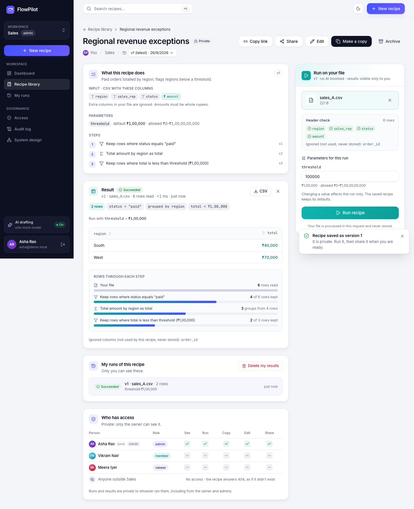
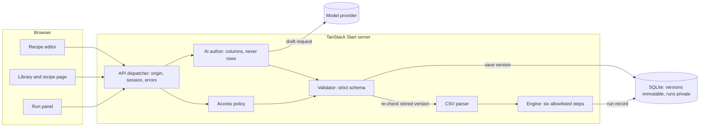

# FlowPilot

**Turn a repetitive CSV report into a recipe your whole team can run.**

Describe the report in one sentence. FlowPilot drafts the steps with AI, and you review and save them as a versioned recipe. Anyone in your workspace can then run it on their own file, with no AI involved and the same result every time, or make an independent copy and adapt it. The original never changes.



The full loop works end to end, and a real browser test proves it: **describe → review → save → run → share → a teammate runs it on their own file → makes a copy → the copy runs independently, and the original is unchanged.**

## Contents

- [Features](#features)
- [Quick start](#quick-start)
- [AI drafting and model choice](#ai-drafting-and-model-choice)
- [A five-minute demo](#a-five-minute-demo)
- [How it works](#how-it-works)
- [API reference](#api-reference)
- [Security and privacy](#security-and-privacy)
- [Testing](#testing)
- [Configuration](#configuration)
- [Deployment](#deployment)
- [Troubleshooting](#troubleshooting)
- [Project structure](#project-structure)
- [Limitations and next steps](#limitations-and-next-steps)

## Features

**Authoring**
- Read a sample CSV in the browser (it is never uploaded) to declare the input columns and their types: text, or amount in whole rupees.
- Describe the report in plain language, in English or Hinglish, and get editable step cards. AI drafts carry a badge until you save them.
- Edit steps by hand, from six kinds: **filter** rows (equals, comparisons, *contains*, *is one of*); **group & sum**; **summarize** by up to three columns with up to five figures (count, total, average, smallest, largest), or over all rows; **sort** by up to three columns; **keep the first N** rows (a "top 10", adjustable per run); and **choose columns**, in order, with friendly headers. Each dropdown offers only the columns available at that step, and a sidebar shows the columns flowing through the pipeline.
- Three column types: text, amounts in whole rupees, and whole numbers (counts and quantities), suggested from the sample file.
- Checks run as you type: every rule is validated live and problems are pinned to the step card they belong to.
- The editor warns when a text value never occurs in your sample (for example "Paid" when the data says "paid") and fixes it in one click.
- *Make adjustable* turns a fixed value into a run parameter, such as a threshold with a default and bounds.
- Advanced JSON view: paste or read the recipe, validated before it is applied.

**Running**
- Run on any file with the declared columns; extra columns are ignored and never stored.
- The file is checked in the browser before anything is sent, so bad amounts, missing columns and ragged rows show with line numbers. Near-miss headers are named (“the file has "Status"”), and files that aren't UTF-8 or that use semicolons or tabs get a plain fix instead of a wall of errors. Switching versions re-checks the chosen file.
- Per-run parameters with *Reset*, and a hint when a filter can never match the chosen file.
- Results show a summary line, a sortable table (large results render 100 rows at a time), the rows remaining after each step, and a formula-safe CSV download.
- Private run history with exact counts per status, filtered on the server, and *Delete my results*.

**Sharing and copies**
- Share with your workspace in one click, and copy a link pinned to one version.
- *Make a copy* creates a private recipe you own that remembers where it came from, and it keeps working even if the original changes or becomes private.
- Every save is an immutable version. Old versions stay runnable and show a “latest is vN” banner.

**Governance**
- Roles: admin, member and viewer, plus outsiders from other workspaces. One policy module decides every permission.
- The Access page renders the permission matrix from that same code; admins change roles there.
- Anything you can't see answers 404, as if it didn't exist. Runs are private even from recipe owners and admins.
- Owners **archive** recipes they no longer need: out of the library, not runnable or copyable until restored, with versions, runs and copies kept.
- Admins get an **audit log**: every recipe, sharing, people, invite and workspace change, filterable by kind and person, exportable as CSV. Runs never appear in it, and private recipes an admin can't see are named only as "a private recipe".
- The library pages 60 recipes at a time, and the ⌘K search asks only for the 7 it shows.

**Accounts and teams**
- Sign up and get your own workspace as its admin, or join a team through an invite link. Sign-ups can be open, invite-only or closed (`REGISTRATION`).
- Invite people by link, in a role, optionally locked to one email address. Links expire after 7 days and can be revoked; only a hash of each link is stored.
- Forgot-password emails with single-use, one-hour links; resetting or changing a password signs out every other device.
- Account settings: your name, your password, and the devices you're signed in on ("Sign out everywhere else").
- Belong to several workspaces and switch between them; lists, the dashboard and the Access page follow the one you're in.
- Admins rename the workspace and remove people. When someone leaves or is removed, their recipes stay with the team: ownership moves to an admin, and a database trigger only ever allows handing a recipe to an admin or member of its workspace. Owners can also hand a recipe over themselves.
- Demo accounts appear only in demo mode (`DEMO_MODE`), and their password, name and memberships are locked, so a shared demo can't be hijacked.

**Around it**
- A dashboard with a checklist of the reuse loop, stats, a 14-day run chart, recent runs and a permission-filtered activity feed.
- A System design page with interactive diagrams and the live schema, triggers, limits and endpoints of the running server.
- ⌘K / Ctrl K search, light and dark themes, a phone-width layout, and pages that pass an automated WCAG 2.1 AA scan.

## Quick start

```bash
npm install
npm run dev        # the first run seeds ./data/flowpilot.db, then serves http://localhost:3000
```

This needs **Node 22 or newer**; it was built on Node 25.3. Nothing else is required, because the database is a local SQLite file. Create an account at `/signup` (you get a workspace of your own), or, in development, sign in with one of the synthetic demo accounts: the login page has one-click buttons, and the password is `flowpilot-demo`.

| Person | Email | Workspace | Role | In the demo |
|---|---|---|---|---|
| Asha Rao | asha@demo.local | Sales | admin | Creates and shares the recipe |
| Vikram Nair | vikram@demo.local | Sales | member | Reruns it on a new file, then makes a copy |
| Meera Iyer | meera@demo.local | Sales | viewer | Can run recipes, but not copy or create them |
| Olivia Chen | olivia@demo.local | Marketing | admin | An outsider to Sales, who sees none of it |

`npm run seed:reset` wipes the database and starts over.

## AI drafting and model choice

AI drafting is optional. Without a key the sidebar shows **AI drafting: Off**: you add steps by hand, and every saved recipe runs, because the run path never touches a model. To turn drafting on, create a git-ignored `.env`:

```bash
MODEL_PROVIDER=openrouter
OPENROUTER_API_KEY=sk-or-...
MODEL_NAME=openai/gpt-6-luna      # the default for OpenRouter
```

Then check it:

```bash
npm run check:model     # is the model reachable, and what does it draft for the demo sentence?
npm run eval:model      # the 21-case eval set below, against the configured model
```

Anthropic (`ANTHROPIC_API_KEY`, which uses a forced tool call) and OpenAI (`OPENAI_API_KEY`, which uses strict `json_schema`) work the same way. With OpenRouter, FlowPilot asks to be routed only to providers that honour a strict `response_format`.

**What the model sees:** your sentence and the declared column names and types, never data rows. Its draft is wrapped with your own input contract, checked by the same strict validator as everything else, repaired at most once, and never saved or run until you save it. Because the model can't see values, the editor checks text values against your sample file locally.

### Why `openai/gpt-6-luna`

`npm run eval:model` sends 21 fixed requests and checks the drafts structurally. It covers drafts, adjustable thresholds, exclusions, a different file layout and a Hinglish request; averages, counts, a top 3, the largest order per group, an overall summary, *is one of* and *contains*; things a recipe can't do (monthly periods, percentage shares, Gmail on a schedule, joins, charts); and an ambiguous column that should get a clarifying question. `openai/gpt-6-luna` passes **21 / 21** (median 3.0 s). The model comparison below was measured on the earlier 14-case set, through OpenRouter on 26 Sep 2026:

| Model | Eval result | Median | Slowest | Price in / out per M tokens |
|---|---|---|---|---|
| **`openai/gpt-6-luna`** (chosen) | **14 / 14** (two runs) | **3.0 s** | 4.4 s | **$0.10 / $0.50** |
| `anthropic/claude-sonnet-5` | 14 / 14 | 5.3 s | 6.8 s | $2 / $10 |
| `google/gemini-3.8-flash` | 14 / 14 | 5.0 s | 8.0 s | $0.75 / $3.75 |

All three are accurate. `gpt-6-luna` is the fastest and costs about a twentieth as much, and a draft is one short call, so each draft costs well under a cent. The eval also found two prompt weaknesses, both since fixed: copying a sentence-initial capital ("Paid orders…" became `"Paid"`), and filtering raw amounts before grouping when the request meant a per-group total. To switch models, change `MODEL_NAME` and re-run `npm run eval:model`.

Each person can generate 10 drafts per minute and 200 per day (`429` with `Retry-After`), so a paid key can't be run up by accident.

## A five-minute demo

Sample files are in `public/samples/`. The editor and the run panel also offer them as one-click buttons.

1. **Asha** → *New recipe* → *Use sales_A.csv*. `order_id` stays unchecked, so it isn't required. Paste *“Keep paid orders, sum amount by region, and show regions with total below a configurable threshold, default 100000.”*, then *Generate steps* and review the three cards. Title the recipe *Regional revenue exceptions* and save it.
   *No key?* Add the steps by hand: filter `status` equals `paid`; group and sum `amount` by `region` as `total`; filter `total` is less than `100000`, then *Make adjustable*.
2. Run it on `sales_A.csv`: **South ₹40,000 · West ₹70,000**.
3. *Share* → *Team*, and copy the version-pinned link.
4. **Vikram** → *Team library* → open the recipe → run it on `sales_B.csv`: **North ₹70,000 · West ₹20,000**. Set the threshold to 50,000 to get **West ₹20,000** only, then *Reset*; the saved recipe never changed.
5. *Make a copy* → set *Group by* to `sales_rep` → *Save as version 2* → run on `sales_B.csv`: **Asha ₹90,000**.
6. **Asha**: the dashboard says *“Vikram Nair made a private copy of your Regional revenue exceptions v1”*, without revealing the copy. Her recipe is still v1 and still grouped by region.
7. **Meera** can run the recipe, but *Make a copy* is disabled. **Olivia** gets *“Nothing here”*: a 404, as if the recipe didn't exist.

| Run | Expected result |
|---|---|
| Original · file A · threshold 100,000 | South 40,000; West 70,000 (North 110,000 excluded) |
| Original · file B · 100,000 | North 70,000; West 20,000 (South 120,000 excluded) |
| Original · file B · 50,000 | West 20,000 only; the saved definition is unchanged |
| Copy grouped by sales_rep · file B · 100,000 | Asha 90,000 only (Vikram 120,000 excluded) |
| Original · file A · 70,000 (boundary) | South 40,000 only; West = 70,000 is excluded by `lt` |
| Original · file B · 20,000 | No rows matched |

## How it works

The full design, with diagrams of the architecture, the run lifecycle, the data model and the account flows, plus the security model, failure modes, deployment and scaling path, is in **[docs/system-design.md](docs/system-design.md)**. The in-app **System design** page (`/system-design`) shows the same, with a live view of the running server's schema, triggers, limits and endpoints.



- **Two paths, one policy.** Authoring (editor → AI author → model → validator → new version) and execution (run panel → policy → validator → CSV parser → engine → private run record) share only the dispatcher, the access policy and the validator. The model is never on the execution path, so saved recipes run even when AI is down.
- **A small recipe language.** A strict JSON document with a declared input, typed parameters and up to 10 linear steps from an allowlist of six (`filter`, `group_sum`, `aggregate`, `sort`, `limit`, `select`). Values are literals, lists or declared parameters, and nothing is ever evaluated. One shared rule (`lib/workflow/columns.ts`) says which columns exist after each step, and the validator uses it to explain problems precisely, e.g. *“Column "status" is no longer available: step s2 summarized the rows, which keeps only "region", "orders"”* or *“…step s5 renamed it to "Region"”*.
- **A deterministic engine.** Sums are exact integers, averages are rounded half up with exact integer maths, groups and sorts order text by code point (never by locale) and ties keep their file order, a 30-second deadline is checked between steps and every 1,024 rows, and a step log records rows in and out.
- **Versions, runs and copies.** Saving appends an immutable version, and title or description edits don't create one. Each run pins the exact version it executed. A copy is a new private recipe whose version 1 points back at one source version.
- **The database enforces invariants itself.** Triggers reject editing or deleting a version; changing a recipe's owner, workspace or copy source; pointing a recipe at another recipe's version; updating a finished run; and editing the audit log.
- **One access policy.** Pure functions in `src/lib/policy.ts` are used by every endpoint and by the Access page's matrix.

<details>
<summary>The recipe format</summary>

```json
{
  "schemaVersion": 1,
  "input": { "format": "csv", "columns": { "status": "string", "region": "string", "sales_rep": "string", "amount": "integer_inr" } },
  "parameters": { "threshold": { "type": "integer", "default": 100000, "min": 0, "max": 1000000000 } },
  "steps": [
    { "id": "s1", "type": "filter", "column": "status", "operator": "eq", "value": { "literal": "paid" } },
    { "id": "s2", "type": "group_sum", "groupBy": "region", "valueColumn": "amount", "as": "total" },
    { "id": "s3", "type": "filter", "column": "total", "operator": "lt", "value": { "parameter": "threshold" } }
  ],
  "output": { "format": "table" }
}
```

`eq` and `neq` work on any column; `lt`, `lte`, `gt` and `gte` on numbers (amounts and whole numbers); `contains` (ignoring capitals) and `in` (`{"list": [...]}`) on text. `eq`, `neq` and `in` match text exactly and case-sensitively. After a `group_sum`, only the group column and the new total remain.

The other steps, as they appear in a recipe:

```json
{ "id": "s2", "type": "aggregate", "groupBy": ["sales_rep"],
  "measures": [{ "op": "sum", "column": "amount", "as": "revenue" }, { "op": "count", "as": "orders" }, { "op": "avg", "column": "amount", "as": "avg_deal" }] }
{ "id": "s3", "type": "sort", "by": [{ "column": "revenue", "direction": "desc" }] }
{ "id": "s4", "type": "limit", "rows": { "parameter": "top_n" } }
{ "id": "s5", "type": "select", "columns": [{ "column": "sales_rep", "as": "Sales rep" }, { "column": "revenue", "as": "Paid revenue" }] }
```

A summary with an empty `groupBy` gives one row over all rows. After a summary only its group columns and figures remain; counts are whole numbers and the other figures keep their column's type. Column types are `string`, `integer_inr` (whole rupees) and `integer` (whole numbers).
</details>

| Action on a team recipe | Owner | Admin | Member | Viewer | Outsider |
|---|---|---|---|---|---|
| See it, run it | ✓ | ✓ | ✓ | ✓ | 404 |
| Make a copy | ✓ | ✓ | ✓ | 403 | 404 |
| Save a new version / change sharing | ✓ | 403 | 403 | 403 | 404 |
| See someone else's runs | 404 | 404 | 404 | 404 | 404 |

**Stack:** TanStack Start (React 19, Vite 8, Nitro), TanStack Router, Query and Table v9, Tailwind CSS v4, Zod 4, Papa Parse, SQLite via better-sqlite3, Vitest, Playwright and axe-core.

## API reference

One server route (`/api/$`) fronts 42 REST endpoints through a single dispatcher, `handleApi(Request)`. The dispatcher matches the route, blocks cross-site writes, reads the session, runs the handler and maps errors. Every response is `Cache-Control: private, no-store`. Every error has the shape `{ "error": { "code", "message", "issues"? , "draft"?, "runId"? } }`. Every path also answers `HEAD` (as `GET`, without a body) and `OPTIONS` (204 with `Allow`); any other method gets 405.

| Method | Path | Who | Purpose |
|---|---|---|---|
| POST | `/api/auth/login` | anyone | `{email, password}` → session cookie. 401 is the same for unknown emails and wrong passwords; throttled per email + address (10), per email (50) and per address (100) in 10 minutes → 429 |
| POST | `/api/auth/logout` | anyone | Ends the session |
| POST | `/api/auth/register` | anyone (per `REGISTRATION`) | `{name, email, password, workspaceName}` → account + workspace, signed in; or `{…, inviteToken}` to join a workspace. 409 if the email is taken |
| POST | `/api/auth/forgot` | anyone | `{email}` → the same answer whether or not the account exists; emails a one-hour reset link |
| GET | `/api/auth/reset/:token` | anyone | Whether a reset link still works (and the masked email) |
| POST | `/api/auth/reset` | anyone with the link | `{token, password}` → new password, every device signed out, this one signed in |
| GET | `/api/health` | anyone | `{"status":"ok"}` when the database answers |
| GET | `/api/me` | signed in | User, memberships, the workspace in use, AI status |
| PATCH | `/api/me` | signed in | `{name}` |
| POST | `/api/me/password` | signed in | `{currentPassword, newPassword}`; signs out your other devices |
| GET | `/api/me/sessions` | signed in | Devices you're signed in on |
| DELETE | `/api/me/sessions` | signed in | Sign out everywhere except this browser |
| POST | `/api/me/workspace` | member of it | `{workspaceId}`: work in another of your workspaces |
| POST | `/api/workspaces` | signed in | `{name}` → a new workspace with you as admin |
| GET | `/api/dashboard` | signed in | Stats, 14-day runs, recent runs, filtered activity, checklist |
| GET | `/api/workflows?scope=mine\|team\|all&q=&limit=&offset=` | signed in | One page of recipes you can read (60 by default, at most 200), newest first, with `total`, `nextOffset` and the count for each tab |
| POST | `/api/workflows` | admin, member | `{title, description, definition}` → private v1 |
| GET | `/api/workflows/:id?v=` | can view | A version, the version list and your permissions |
| PATCH | `/api/workflows/:id` | owner | `{title?, description?, visibility?, archived?}` (unknown keys → 422) |
| POST | `/api/workflows/:id/versions` | owner | `{definition}` → the next immutable version |
| POST | `/api/workflows/:id/fork` | admin, member who can view | `{versionId, title}` → a private copy |
| GET | `/api/workflows/:id/access` | can view | Workspace members and what each can do |
| POST | `/api/workflows/:id/transfer` | owner | `{userId}` → hand the recipe to an admin or member of its workspace |
| POST | `/api/generate` | signed in | `{request, columns}` → a draft, “unsupported” or a question; never writes |
| POST | `/api/runs` | can view | Multipart `{versionId, file, parameters}` → result, summary and step log |
| GET | `/api/runs?workflowId=&status=&limit=` | signed in | Your own runs only, newest first (at most 500), with exact `counts` per status |
| DELETE | `/api/runs?workflowId=` | signed in | Delete your finished runs |
| GET | `/api/runs/:id` | the runner | The full result and step log |
| GET | `/api/runs/:id/csv` | the runner | A formula-escaped CSV attachment (409 if the run has no result) |
| GET | `/api/workspace` | member | Members, roles and how many recipes each owns |
| PATCH | `/api/workspace` | admin | `{name}` |
| POST | `/api/workspace/leave` | member | Leave; your recipes move to an admin. The last admin can't leave |
| PATCH | `/api/workspace/members/:userId` | admin | `{role}`; not your own, and never the last admin |
| DELETE | `/api/workspace/members/:userId` | admin | Remove someone; their recipes move to you |
| GET | `/api/workspace/audit?category=&actor=&before=&limit=` | admin | The audit log, newest first (no runs; private recipes unnamed) |
| GET | `/api/workspace/audit.csv` | admin | The same log as a formula-safe CSV |
| GET | `/api/workspace/invites` | admin | Invite links that can still be used |
| POST | `/api/workspace/invites` | admin | `{role, email?}` → a link (single use when locked to an email; emailed if mail is set up) |
| DELETE | `/api/workspace/invites/:id` | admin | Revoke a link |
| GET | `/api/invites/:token` | anyone with the link | Who invited you, to which workspace and role |
| POST | `/api/invites/:token/accept` | signed in | Join (or switch to) that workspace |
| GET | `/api/system` | signed in | Schema, triggers, limits and endpoints: structure only, never rows |

Status codes: 401 not signed in · 403 visible but not yours, a cross-site write, or an account rule (demo accounts, closed sign-ups) · 404 not visible to you, or an invite/reset link that no longer works · 409 email taken, already a member, or nothing to download · 413 over 1 MiB · 415 wrong content type · 422 validation failed, with `issues` · 429 too many attempts, with `Retry-After` · 500 run failed (`TIMEOUT`, `EXECUTION_ERROR`) · 503 AI unavailable.

## Security and privacy

- Passwords are hashed with scrypt and a random salt, and must be at least 10 characters and not a common password. Sessions are 256-bit tokens in an HttpOnly, SameSite=Lax cookie (Secure on HTTPS), and only a SHA-256 hash of each token is stored; the same goes for invite and password-reset links. Signing in replaces the browser's previous session and purges expired ones. After signing in you are only ever sent to a path on this site.
- Sign-in is throttled per email and address, so an attacker can't lock someone out just by knowing their email. Sign-ups and reset requests are rate-limited too, and "forgot password" answers the same for every address. Reset links are single use, last an hour and sign out every device.
- Cross-site writes are rejected by an Origin check, and server functions have Start's CSRF middleware. Responses send `X-Frame-Options: DENY`, `nosniff` and `Referrer-Policy`. Login controls stay disabled until the page is interactive, so a native form submit can never put credentials in a URL.
- Identity always comes from the session: an `owner_id` sent by a client is ignored on create and rejected on update. Recipe definitions are re-validated on save, on copy and before every run.
- Uploaded files are processed inside the request and never stored. Results are visible only to the person who ran them, and anyone can delete their own. CSV exports escape formula-like cells.
- AI keys live only on the server, and `.env` is git-ignored. Drafting is rate-limited per person. Text from users or the model is always rendered as text, never as HTML.

## Testing

```bash
npm test                          # 133 unit and API tests
npx playwright install chromium   # once
npm run test:e2e                  # 26 browser tests
npm run typecheck
npm run smoke                     # every endpoint and error code against a running server (--base <url>)
```

- **Unit and API tests (Vitest), 129 in total:** engine 13, CSV 18, validator 13, access 20, demo loop 12, AI 10, hardening 12 (HTTP methods, redirects, sessions, no-op edits, the activity feed on a busy team, list paging and run counts), accounts 17 (sign-up modes and rules, invitations, password resets, account settings, workspaces, removal and hand-over), language 14 (summaries and exact rounding, sort, top N, column choices, *contains* and *is one of*, whole numbers, validation messages, the seeded examples, a top-N run and CSV export through the API), governance 4 (archive and restore, the audit log's privacy rules, filters, paging and CSV). They call the same `handleApi(Request)` the server uses, with real session cookies, against an in-memory SQLite database, so access rules are tested end to end rather than mocked. The model is always stubbed, and the tests never read `.env`.
- **Browser tests (Playwright), 26 in total:**
  - `demo.spec.ts` (4) is the demo above.
  - `features.spec.ts` (15) covers the rest: the editor's value warning, an invalid AI draft and a clarifying question, Advanced JSON, in-browser file checks, samples and parameters, details-only saves and versions, runs from another recipe, large results, CSV escaping, the command palette, theme, roles, *Delete my results*, the mobile drawer, re-checking a file when the version changes, refusing a non-UTF-8 file, the in-app 404, wide tables at phone width, library paging, an AI-drafted top-N summary edited with the new step cards and run, and archiving plus the audit log.
  - `accounts.spec.ts` (5): a new team signs up, invites a teammate who joins through the link and runs a shared recipe; the workspace switcher (mouse and keyboard); account settings and a password change that signs out another device; forgot-password and dead links; the sign-in pages at phone width.
  - `a11y.spec.ts` (2) runs an axe-core WCAG 2.1 AA scan of every page, including sign-up, invitations and account settings, in light and dark mode.
- The browser tests use their own database and a stand-in model (`tests/e2e/mock-model.ts`), so they never spend real credits. Screenshots of each demo stage are saved to `docs/screenshots/`.
- **Model quality:** `npm run eval:model`, described above.
- **Smoke test:** `npm run smoke` signs up two throwaway accounts on any running FlowPilot and makes 71 checks across all 42 endpoints: the happy paths and the important errors (401, 403, 404, 405, 409, 413, 415, 422). It is how a deployment is verified: `npm run smoke -- --base https://your-app`.

## Configuration

| Variable | Default | Purpose |
|---|---|---|
| `DATABASE_PATH` | `./data/flowpilot.db` | SQLite file |
| `SEED_PASSWORD` | `flowpilot-demo` | Password for the demo accounts, set at seed time |
| `DEMO_MODE` | on in development, off in production | One-click demo accounts on the sign-in page; in production also seeds them into an empty database |
| `REGISTRATION` | `open` | `open`, `invite-only` (only through an invite link) or `closed` |
| `APP_URL` | the request's origin | Public URL used in emailed links |
| `TRUST_PROXY` | `false` | Believe `Fly-Client-IP` / `X-Forwarded-For` for rate limits (only behind a proxy you control) |
| `RESEND_API_KEY` / `MAIL_FROM` | none | Send invite and reset emails through Resend; without them the emails are written to the server log |
| `MODEL_PROVIDER` | inferred from whichever key is set | `anthropic`, `openai` or `openrouter` |
| `MODEL_NAME` | `claude-sonnet-5` · `gpt-5` · `openai/gpt-6-luna` | Model for the chosen provider |
| `OPENROUTER_API_KEY` / `ANTHROPIC_API_KEY` / `OPENAI_API_KEY` | none | Turns on AI drafting |
| `OPENROUTER_BASE_URL` / `ANTHROPIC_BASE_URL` / `OPENAI_BASE_URL` | the public APIs | Optional override, e.g. a proxy or the e2e mock |

`.env.example` lists all of them. `.env` is loaded by the server and scripts; real environment variables win over it.

## Deployment

```bash
npm run build        # Nitro output in .output/
npm start            # node .output/server/index.mjs (PORT defaults to 3000)
```

- Serve it over **HTTPS**; session cookies become `Secure` automatically.
- Keep `DATABASE_PATH` on a **persistent disk**. The server is a single process, because SQLite has a single writer.
- Seed once with a private `SEED_PASSWORD`, or replace the demo accounts; there are no sign-ups yet.
- Point your platform's health check at **`/api/health`**.

## Troubleshooting

| Symptom | Fix |
|---|---|
| `npm install` fails building `better-sqlite3` | Use Node 22 or newer. If no prebuilt binary exists for your platform, install build tools (Xcode Command Line Tools, or `build-essential` + Python 3) |
| Port 3000 is in use | `PORT=3100 npm run dev` |
| AI drafting shows Off | Check the `.env` key and `MODEL_PROVIDER`, then restart the dev server and run `npm run check:model` |
| “AI generation is unavailable (… out of credits, HTTP 402)” | Top up the provider account; saved recipes keep running meanwhile |
| A run says “No rows matched” | Look for the amber hint in the run panel. Text matching is case-sensitive (“Paid” is not “paid”) |
| “This file isn't saved as UTF-8 text” | Excel's plain *CSV* uses Windows-1252. Use File → Save As → *CSV UTF-8 (Comma delimited)*, or download a CSV from Google Sheets |
| “This file separates values with semicolons” (or tabs) | Excel in many locales saves with semicolons. Save as *CSV UTF-8 (Comma delimited)* |
| “Missing required column: status (the file has "Status")” | Column names must match exactly, including capitals: rename the header in the file |
| E2E tests can't find a browser | `npx playwright install chromium` |
| A password-reset or invite email never arrives | Without `RESEND_API_KEY` and `MAIL_FROM` the email is written to the server log instead: copy the link from there |
| "Too many accounts were created from here recently" | Sign-ups are limited to 20 an hour per address; behind a proxy set `TRUST_PROXY=true` so each visitor counts separately |
| You want a clean slate | `npm run seed:reset` |

## Project structure

```
src/lib/workflow/     the recipe language: schema, validate, execute, describe, draft, examples
src/lib/              csv, policy, account rules, samples, api client, shared types, formatting, redirects, session server functions
src/server/           db + migrations (triggers), auth, accounts, repo, audit events, rate limits, mail, config, boot, seed, http helpers
src/server/api/       the dispatcher (router.ts) and one file per resource
src/server/ai/        model config and the generate loop (Anthropic, OpenAI, OpenRouter)
src/routes/           login, signup, invite, forgot/reset password, _app (guard + shell), dashboard, library, editor, recipe, runs, access, account, system design, api/$
src/components/       UI kit, shell, command palette, editor, results grid, run chart, diagrams, dialogs
src/start.ts          global middleware: security headers, server-function CSRF
tests/                Vitest suites · tests/e2e: Playwright specs and the mock model
scripts/              seed, check-model, eval-model, smoke, screenshots
docs/                 system-design.md (architecture, data model, flows, security) · screenshots/
fixtures/             demo and invalid CSVs used by the tests · public/samples: downloadable demo files
context.md            project memory: status, decisions, deviations, known issues
```

## Limitations and next steps

This is a working prototype, not a production platform:

- **Single node.** SQLite suits one server process. The next step is Postgres with row-level security mirroring `lib/policy.ts`.
- **Small, synchronous runs.** Up to 1 MiB, 5,000 rows and 50 columns per file, run inside the request with a 30-second deadline. There is no queue, scheduling or retry.
- **Six step types.** Filter, group & sum, summarize, sort, keep first N and choose columns: no joins, dates or periods, percentages or charts yet. The AI says so instead of pretending.
- **Accounts.** Email and password only: no SSO, two-factor sign-in or email verification yet, and accounts can't be deleted from the UI.
- **In-memory limits.** Sign-in, sign-up, reset and drafting limits live in the server's memory, so they reset on restart and aren't shared between servers (Redis would fix both).
- **No deleting recipes.** Versions are immutable by design.
- **Other small gaps:**
  - Dashboard days are in UTC.
  - CSV line numbers count records, the way a spreadsheet numbers rows; in a text editor, a quoted field containing a newline shifts the numbers after it.
  - Lists show one page at a time: 60 recipes in the library (with *Show more*) and your latest 500 runs (the counts are always exact).
  - The model can't see values, so rely on the editor's sample check for text casing.
- **Local only.** Everything has been run locally; nothing is deployed.

Decisions, deviations from the original brief and known issues are logged in [`context.md`](context.md).
