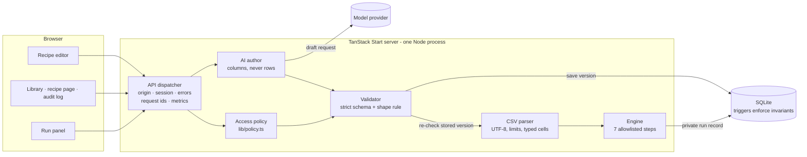
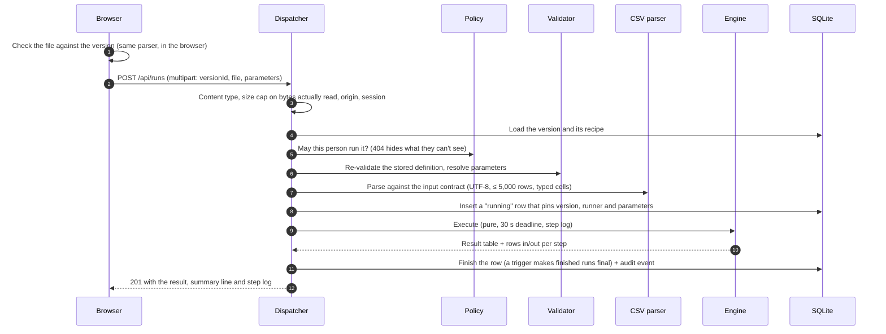
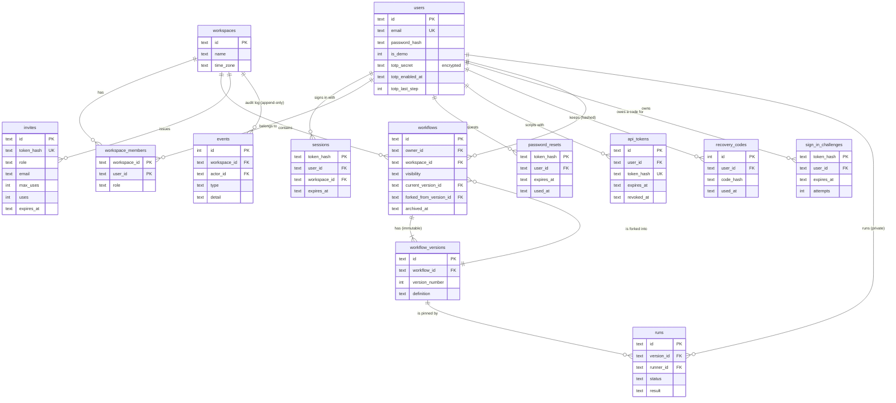
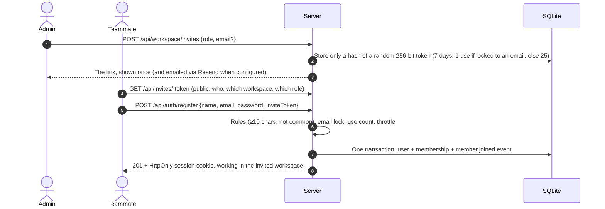
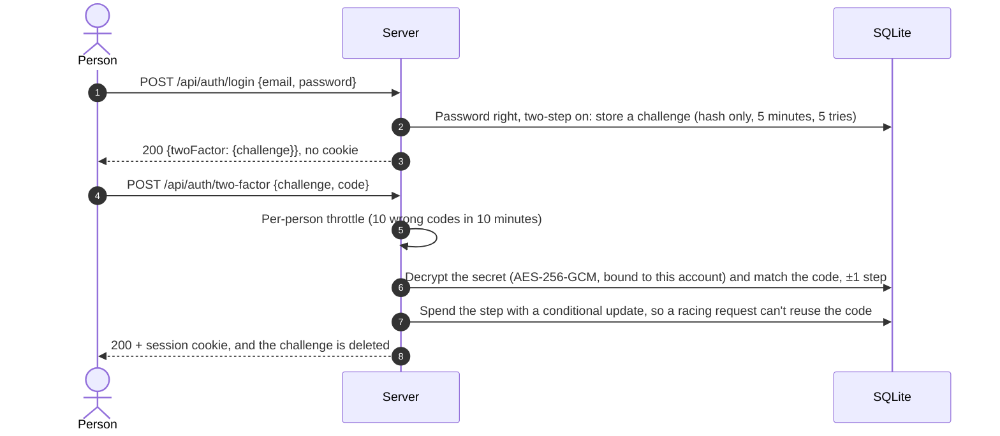
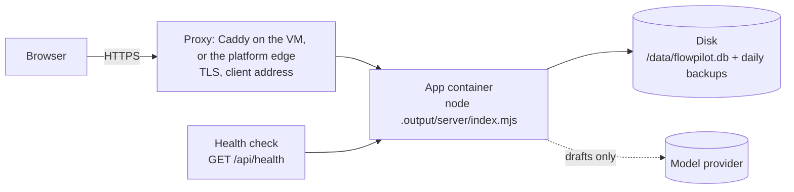

# FlowPilot system design

FlowPilot turns a one-sentence description of a repetitive CSV report into a saved, versioned **recipe** that a team can rerun on their own files, share and adapt. This document explains how it is built and why. The running app has an interactive version of it at `/system-design`, with the live schema, triggers, limits and endpoints of the server you are looking at.

**The core idea:** AI drafts a recipe; people review and save it; a deterministic engine runs it, with no AI on reruns. One access policy guards every request.

## Contents

1. [Architecture](#1-architecture)
2. [Pressing Run: the request lifecycle](#2-pressing-run-the-request-lifecycle)
3. [The recipe language](#3-the-recipe-language)
4. [AI authoring](#4-ai-authoring)
5. [Data model](#5-data-model)
6. [Identity, teams and workspaces](#6-identity-teams-and-workspaces)
7. [Access policy](#7-access-policy)
8. [Security model](#8-security-model)
9. [Failure modes](#9-failure-modes)
10. [Observability](#10-observability)
11. [Deployment](#11-deployment)
12. [Scaling path](#12-scaling-path)
13. [Trade-offs](#13-trade-offs)

## 1. Architecture

Two paths share only the dispatcher, the access policy and the validator:

- **Authoring** (purple in the app): editor → AI author → model provider → validator → a new immutable version.
- **Execution** (teal): run panel → policy → validator → CSV parser → engine → a private run record.

The model is never on the execution path, so saved recipes keep running when the AI provider is down, slow or unconfigured.

All 52 REST endpoints sit behind one dispatcher, `handleApi(Request)`. It matches the route, answers `HEAD` and `OPTIONS`, rejects cross-site writes, reads the session or the bearer token, runs the handler, and maps every error to one JSON shape. It also stamps every response with a request id and times, counts and logs every request by its route pattern (see [Observability](#10-observability)). Tests call the same function directly.

## 2. Pressing Run: the request lifecycle

Uploaded files are processed inside the request and never stored. A run row stuck in `running` for over 60 seconds, for example after a crash, is reported as failed `STALE`.

## 3. The recipe language

A strict JSON document: a declared input, typed parameters, and up to 10 linear steps from an allowlist. Values are literals, lists or declared parameters. Nothing is ever evaluated as code.

| Step | What it does | Columns afterwards |
|---|---|---|
| `filter` | Keep rows where a column equals, doesn't equal or compares (numbers and dates); `contains` (text, ignoring capitals); `in` a list. A date compares with a fixed day, a date parameter, or a day relative to the run day (`relative`: unit, offset, start or end) | Unchanged |
| `group_sum` | Group by one text column and total one amount column | The group column and the total |
| `aggregate` | Group by 0–3 text or whole-number columns; up to 5 figures: count, sum, avg, min, max | The group columns and the figures |
| `sort` | Up to 3 keys, ascending or descending; stable; text ordered by code point | Unchanged |
| `limit` | Keep the first N rows (fixed or a run parameter); after a sort, a top N | Unchanged |
| `select` | Keep the listed columns in order, with optional display headers | Exactly the listed columns |
| `date_part` | Add the year, quarter, month or ISO week a date falls in (`2026-Q3`, `2026-09`, `2026-W39`) as a text column | Everything before, plus the period |

- **Types:** text, amounts in whole rupees (`integer_inr`), whole numbers (`integer`, for counts and quantities) and dates (`date`, kept as `YYYY-MM-DD` text so text order is calendar order; the maths runs on day numbers, never on a time zone). Nothing is silently rounded, treated as zero or guessed: a cell like `03/04/2026` is reported with both readings instead of being read one way.
- **Relative dates** ("the start of last month", "30 days ago") count from the day the recipe runs, in the workspace's time zone: a workspace keeps its own calendar, so a run at 01:30 in India counts on that Indian day, whether it comes from the run panel or a script. The runner can choose another day; it is stored beside the run's parameters as `as_of` and the summary shows what each relative date meant. Averages are rounded half up with exact `BigInt` maths, and the step's description says so.
- **Comparing runs.** `lib/compare.ts` reads a result against an earlier run of the same recipe: rows are matched by their labels (text and date columns), figures are compared as exact integers, and results whose columns changed or whose labels repeat say why they can't be matched instead of guessing. Only the viewer's own runs are offered, so runs stay private.
- **One shape rule.** `lib/workflow/columns.ts` decides which columns exist after each step. The engine, the validator, the editor, the plain-language descriptions and the AI adapter all use it, so they can't disagree. The validator explains problems in terms people understand: *"Column "status" is no longer available: step s2 summarized the rows, which keeps only "region", "orders"."*
- **Immutable versions.** The language only grows. Every version saved before a step type existed still runs exactly as before.

- **Templates.** `lib/workflow/templates.ts` holds ten hand-written recipes, each paired with a sample file; the New recipe page loads one as an ordinary draft (with the sample's values for hints). They are validated and run on their samples in `tests/templates.test.ts`, so a template can never go stale silently.

## 4. AI authoring

- **What the model sees:** the user's sentence and the declared column names and types, never data rows.
- **Structured output:** Anthropic uses a forced tool call; OpenAI and OpenRouter use strict `json_schema` (OpenRouter is asked to route only to providers that honour it). The schema is flat, with one variant per step type.
- **Validation:** the reply is parsed leniently, turned into a definition with the author's own input contract (values placed by column type), then validated exactly like input from a browser. One automatic repair is allowed; after that the draft is returned with its problems pinned to step cards (`422 DRAFT_INVALID`).
- **Honesty:** requests the language can't express (email, schedules, joins, charts, percentages) get `unsupported` with a reason. Ambiguous columns get one clarifying question.
- **Cost control:** each person can make 10 drafts per minute and 200 per day.
- **Evaluation:** `npm run eval:model` runs 28 fixed requests and checks the drafts structurally. The chosen model, `openai/gpt-6-luna`, passes 28/28 with a median of 3.6 s.
- **Casing safety net:** because the model can't see values, the editor and the run panel compare text filters with the actual file, in the browser, and offer one-click fixes such as "Paid" → "paid".

## 5. Data model

**Invariants in the database itself.** Fifteen SQLite triggers make the rules hold whatever code path writes:

- versions can't be edited or deleted, and are numbered sequentially by their recipe's owner;
- a recipe's workspace and copy source never change, and ownership can only move to an admin or member of its workspace;
- the current pointer must be the recipe's own version;
- runs start as `running`, pin a version of their own recipe, and are final once finished;
- the audit log is append-only;
- two-step sign-in is on only with both a secret and a start time, and never for a shared demo account.

Seven migrations are tracked in `schema_migrations`.

## 6. Identity, teams and workspaces

- **Sign-up** without an invite creates a workspace with the new user as its admin. `REGISTRATION` can be `open`, `invite-only` or `closed`.
- **Sessions** are 7-day, 256-bit tokens in an HttpOnly, SameSite=Lax cookie (Secure on HTTPS). Only SHA-256 hashes are stored. Expired sessions are purged at sign-in, and the account page can sign out every other device.
- **Password resets:**
  - forgot-password gives the same answer for every email;
  - links are single use and last one hour;
  - completing a reset signs out every device;
  - with two-step sign-in on, a reset still asks for a code: the link proves the inbox, not the phone.
- **Workspaces.** A person can belong to several. Each browser session works in one, chosen with the sidebar switcher, and lists, the dashboard, activity and the Access page follow it. Each workspace has a time zone (from the browser at sign-up, stored under its modern name, since Chrome still reports Asia/Kolkata as Asia/Calcutta; admins can change it, and the change is audited).
- **People leaving.** Their recipes move to an admin, so the team keeps its work. Their own runs stay private to them.
- **Throttles.** Sign-in failures are counted per email plus address (10), per email (50) and per address (100) in 10 minutes. An attacker can't lock someone out just by knowing their email.
- **Demo mode** (`DEMO_MODE`) adds one-click demo accounts that are locked against password, name and membership changes.

### Two-step sign-in

- **Codes** follow RFC 6238 (HMAC-SHA1, 6 digits, 30 seconds), implemented on Node's crypto and checked against the RFC's test vectors. One step of clock drift either way is accepted; a spent step, and every older one, never is.
- **Secrets** are encrypted at rest with AES-256-GCM under a key kept outside the database: `SECRET_KEY`, or a random `secret.key` created beside the database (mode 600). The account id is authenticated data, so a secret copied onto another row decrypts to nothing. A database backup alone reveals no secret.
- **Recovery codes:** ten per person, about 49 bits each, from an alphabet without look-alike characters, stored as SHA-256 hashes and spent with a conditional update. They also work when the encryption key is lost.
- **Turning it on** shows a QR code (an `otpauth://` link drawn as SVG in the browser) and needs the password and a first code; the other devices are signed out and an email is sent. **Turning it off** needs the password and a code. Operators can switch it off for a locked-out person with `scripts/two-factor-off.mjs`.
- **API tokens** are separate credentials created while signed in; they keep working and still can't touch account or security settings.

## 7. Access policy

Pure functions in `src/lib/policy.ts` decide every permission. The API enforces them on every request, and the Access page renders its matrix from the same functions.

| Action on a team recipe | Owner | Admin | Member | Viewer | Outsider |
|---|---|---|---|---|---|
| See it, run it | ✓ | ✓ | ✓ | ✓ | 404 |
| Make a copy | ✓ | ✓ | ✓ | 403 | 404 |
| Save a version, share, archive, hand over | ✓ | 403 | 403 | 403 | 404 |
| See someone else's runs | 404 | 404 | 404 | 404 | 404 |
| Invite or remove people, change the workspace's name or time zone, read the audit log | — | ✓ | 403 | 403 | 404 |

**404 hides existence;** 403 means "you can see it, but it isn't yours to change". Admins manage people, not recipes. The audit log never lists runs, and never names private recipes the admin can't see.

## 8. Security model

| Threat | Mitigation | Evidence |
|---|---|---|
| Seeing another team's recipes or runs | One policy on every request; 404 hides existence; runs private to the runner | `tests/access`, `tests/hardening` |
| Cross-site request forgery | Origin check on every write (sign-up and resets included); SameSite=Lax cookie | `npm run smoke` |
| Stolen database | scrypt passwords; sessions, invites and reset links stored only as hashes; authenticator secrets encrypted under a key outside the database; recovery codes hashed | `tests/accounts`, `tests/totp`, `tests/two-factor` |
| Stolen password | Optional two-step sign-in: replay-proof codes, throttled per person across challenges; a password reset can't bypass it | `tests/two-factor`, browser test, smoke |
| Link tokens leaking into logs | Logs and metrics name route patterns (`/api/invites/:token`), never raw paths | `tests/observability` |
| Password guessing and lockout abuse | Three-way sign-in throttle; strong-password rules | `tests/accounts` |
| Account enumeration | Uniform sign-in errors with a dummy scrypt; uniform forgot-password answer | `tests/accounts` |
| Open redirect after sign-in | Same-site paths only; control characters refused | `tests/hardening` |
| Stolen or leaked API token | Tokens are `fp_`-prefixed, stored only as SHA-256 hashes, expire (30/90/365 days), are revocable, and can never reach account, password, membership or token endpoints (`403 SESSION_REQUIRED`) | `tests/tokens` |
| Spreadsheet formula injection | Formula-like cells escaped in every CSV export; the Excel export writes text cells, never formulas | `tests/csv`, `tests/governance`, `tests/spreadsheet` |
| Hostile workbooks (archive bombs, macros) | Excel/ODS files are converted to CSV in the browser by SheetJS (loaded on demand): 4 MB cap, only zip/CFB bytes accepted, reading stops at 10,002 rows; the server only ever parses CSV | `tests/spreadsheet`, browser test "Excel files" |
| Code injection via recipes or AI | Allowlisted steps; literals and declared parameters only; nothing evaluated | `tests/validator`, `tests/language` |
| Data leakage to the model; prompt injection | Only the sentence and column names are sent; output validated like any client input | `tests/ai` |
| Hostile uploads | 1 MiB cap on bytes read, 5,000 rows, 50 columns, strict UTF-8, 30 s deadline | `tests/csv`, `npm run smoke` |
| Clickjacking and sniffing | `X-Frame-Options: DENY`, `nosniff`, `Referrer-Policy`, `no-store` | `npm run smoke` |
| Tampering below the API | Triggers: immutable versions, final runs, append-only audit log, hand-over rules | `tests/access` |

## 9. Failure modes

Every failure has an outcome the user can read, and none can corrupt a stored recipe or another person's data.

| Failure | What the user sees |
|---|---|
| Model provider down, slow (20 s) or not configured | 503 "AI generation is unavailable… saved recipes still run"; manual editing works |
| Model returns an invalid draft | 422 with the draft loaded in the editor and problems on each step card |
| Missing column, bad amounts, duplicate or empty headers | 422 with up to 20 line-numbered issues, checked in the browser first |
| File saved as Windows-1252, UTF-16 or with semicolons | 422 naming the cause and the "Save As → CSV UTF-8" fix |
| Excel workbook whose first sheet is a cover page | The sheet picker in the drop zone; the chosen sheet is re-converted and re-checked |
| A CSV renamed `.xlsx`, a password-protected or oversized workbook | Refused in the browser with the reason, before anything is read or sent |
| Recipe archived by its owner | 409 `RECIPE_ARCHIVED`; the owner can restore it |
| Invite or reset link expired, used or revoked | 404 with "ask for a new one" |
| Too many sign-ins, sign-ups, resets or drafts | 429 with `Retry-After` |
| Execution over 30 s | Run stored as failed `TIMEOUT` |
| Process crash mid-run | Run reported as failed `STALE` |
| Someone edits a recipe you're viewing | Your pinned version keeps working; a banner says "latest is vN" |
| Wrong or stale authenticator code | 401 `INVALID_CODE` with the tries left; after five, sign in again; recovery codes still work |
| The key for authenticator secrets is lost or changed | App codes stop working (a warning is logged); recovery codes sign people in, and they set it up again |
| Two results can't be compared row by row | The comparison says why (columns changed, or labels repeat) |
| An unexpected server error | 500 `INTERNAL_ERROR` quoting the request id, which finds the log line with the cause |

## 10. Observability

- **Request ids.** Every API response carries `X-Request-Id`. An id a proxy already assigned is kept when it is safe to log; anything else is replaced. Error bodies include it, and an unexpected error quotes it, so a person's report leads to the log line.
- **Structured logs.** One line per API request (`LOG_FORMAT`: JSON in production, short text in development), with the route pattern, status, duration, caller and request id. Patterns, not raw paths, so invite and reset tokens never reach logs. Warnings and errors are always written, with their request id.
- **Metrics.** `GET /api/metrics` serves the Prometheus text format when `METRICS_TOKEN` is set (404 otherwise; the bearer token is compared in constant time). Counters and histograms live in the process: requests by method, route and status, latency per route, runs, AI drafts, sign-ins and second-step checks. Gauges are read from the database when scraped: accounts, workspaces, recipes, versions, runs, active sessions and tokens. Event-loop lag (sampled every 20 ms) shows when synchronous work holds up other requests. Unknown HTTP methods share one label value, so a client can't create unbounded series.
- **No dependencies.** The registry, the text format and the logger are under 300 lines (`src/server/observability.ts`), tested like any other code.

## 11. Deployment

- **One process, one disk.** SQLite has a single writer, so production runs one machine with the database on a persistent disk. Migrations apply on start. In `DEMO_MODE`, an empty database is seeded on the first request.
- **Two kits.** `deploy/oracle/` runs the app behind Caddy (automatic HTTPS) on an Oracle Cloud Always Free VM at no cost, with a daily online SQLite backup (`scripts/backup-db.mjs`: consistent snapshot, integrity check, newest 14 kept). `fly.toml` runs it on Fly.io (paid after the trial) with a volume.
- **Configuration:**
  - `DATABASE_PATH=/data/flowpilot.db`
  - `REGISTRATION`
  - `DEMO_MODE`
  - `TRUST_PROXY=true` behind Caddy or nginx (the last `X-Forwarded-For` hop, the one the proxy appended), `fly` on Fly.io (`Fly-Client-IP`); each mode believes exactly one header the proxy writes, so a client's own forwarded headers can't spoof rate limits
  - `APP_URL`
  - secrets: `OPENROUTER_API_KEY`, and optionally `RESEND_API_KEY` and `MAIL_FROM`
  - `SECRET_KEY` (or the generated `/data/secret.key`, kept apart from database backups), `METRICS_TOKEN`, `LOG_FORMAT`
- **Verification:** the platform polls `/api/health`, and `npm run smoke -- --base https://<app>` exercises all 52 endpoints, two-step sign-in included, and their error codes against the deployment.

## 12. Scaling path

| Concern | Today | Next (first real teams) | At scale |
|---|---|---|---|
| Storage | SQLite (WAL) with triggers, one file | Postgres with row-level security mirroring `lib/policy.ts` | Read replicas; runs partitioned by month |
| Execution | In the request, ≤ 5,000 rows, 30 s | A job queue and workers; inputs in object storage with a short TTL | A columnar engine (e.g. DuckDB) streaming large files |
| Identity | Email and password, two-step sign-in (TOTP, recovery codes), invites, resets | SSO / OIDC, passkeys, email verification | SCIM provisioning; workspaces that require two-step sign-in |
| Rate limits | In memory, one server | Redis, shared across servers | Edge rate limiting |
| Observability | Request ids, JSON request logs, Prometheus metrics, audit log, health check, smoke test | OpenTelemetry traces; alert rules on errors and run latency | SLOs on run latency and failure rate |

## 13. Trade-offs

| Decision | Gain | Cost |
|---|---|---|
| Linear steps, not a graph | Simple to validate, render as cards and explain | No branches, joins or loops |
| Deterministic engine, not an LLM runtime | Reproducible, auditable, cheap; runs with the model offline | Only what the seven step types can express |
| Schema-only prompts | No customer rows leave the server | The model can't see value casing (the browser checks it) |
| Immutable versions | Runs and pinned links stay reproducible | Every edit is a new version |
| Copy, not reference | A copy never breaks when its source changes or goes private | Copies don't receive upstream fixes |
| Synchronous execution | No queue to operate | Bounded to small files |
| 404 for anything you can't see | Ids can't be probed | Less specific errors for people without access |
| SQLite and triggers | Zero setup; invariants still enforced in the database | Single node; Postgres with RLS is the production path |
| Authenticator codes (TOTP) for the second step | Works offline with any app; no SMS cost or SIM-swap risk | A code can still be phished in real time, unlike passkeys |
| Metrics kept in the process | No agent or extra service; one scrape shows everything | Counters reset on restart and are per machine |
| One time zone per workspace | A team, its scripts and its dashboard agree on "today" | Someone travelling still sees the team's day |
